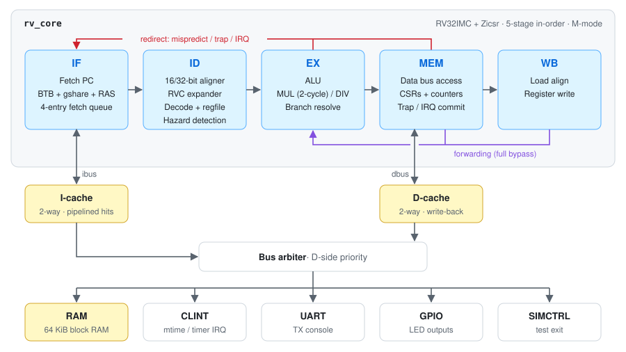

# RV32IMC Pipelined RISC-V CPU + SoC: Design & Verification

[](https://github.com/rkottomt/rv32imc-pipelined-core/actions/workflows/ci.yml)

A 5-stage, in-order, pipelined **RISC-V (RV32IMC + Zicsr, machine mode)** processor written in Verilog. It comes with caches, branch prediction and a small SoC, and is verified with the techniques an industry DV team uses:
- golden-model co-simulation;
- constrained-random stimulus with functional coverage;
- formal proofs;
- mutation testing.

It targets a Lattice ECP5 FPGA (ULX3S board) through a fully open-source synthesis and place-and-route flow.

## Highlights

| | |
|---|---|
| **ISA** | RV32I + M (mul/div) + C (compressed) + Zicsr, M-mode traps and interrupts (timer/software/external, vectored `mtvec`), performance counters |
| **Pipeline** | IF → ID → EX → MEM → WB, full forwarding, 1-cycle load-use, precise exceptions at the MEM commit point |
| **Front end** | Decoupled fetch with a 4-entry queue; aligner for 16/32-bit instructions, including ones straddling two words; **BTB + gshare + return-address stack** |
| **Memory** | 2-way I-cache (pipelined hits); 2-way **write-back** D-cache with store→load bypass; FENCE.I coherence (D$ flush + I$ invalidate) |
| **SoC** | Bus arbiter, 64 KiB RAM (optional DRAM-like latency), CLINT timer, UART, GPIO |
| **Performance** | **2.88 CoreMark/MHz**, **1.03 DMIPS/MHz**, CoreMark IPC 0.81 |
| **FPGA** | ECP5-85F: 17% LUTs, 24% BRAM, **34.7 MHz** post-route Fmax after timing closure (from 24.7) |

## Verification at a glance

| Method | Result |
|---|---|
| Official **riscv-tests** (rv32ui/um/uc/mi, built with and without RVC) | **113/113 pass** on the core and on the cached SoC, also under 40% random bus stalls |
| **Lock-step ISS co-simulation** over RVFI (independent Python golden model) | Every retired instruction checked (9 architectural fields) |
| **Constrained-random** generator: hazard-dense code, traps, random bus latency/back-pressure, random interrupts | 500+ seeds pass on the core and on a tiny-cache SoC with slow memory |
| **Functional coverage** (instructions × hazards × branches × memory × traps × alignment) | **100%** (234/234 bins) after coverage-driven generator improvements |
| **Code coverage** (Verilator line + toggle) | 92%; holes closed with directed tests |
| **Formal**: riscv-formal on SymbiYosys (all 70 instruction checks + reg / pc / causal / unique / ill) | **77/77 pass** (BMC, Yices) |
| **cocotb unit tests**: exhaustive RVC expander (49,152 encodings), M-unit corner cross-product, D-cache random scoreboard | Pass |
| **Mutation testing**: 16 realistic injected bugs (forwarding, hazards, cache, predictor, CSR) | **16/16 detected** |

**Real bugs found and fixed:**
- a divider operand race under memory latency (random co-sim);
- a minstret commit-point bug (riscv-tests);
- an RVFI interrupt-flag corner case (formal);
- a CSR latch (synthesis lint);
- a branch-predictor design flaw costing 11% IPC (performance profiling).

## Architecture
<picture>
  <source media="(prefers-color-scheme: dark)" srcset="docs/img/block_diagram_dark.svg">
  
</picture>

Details: [micro-architecture](docs/01_microarchitecture.md), [front end](docs/02_frontend.md), [caches & SoC](docs/04_caches_soc.md).

## Quick start
```bash
scripts/fetch_third_party.sh          # riscv-tests, riscv-formal, coremark
# tools: OSS CAD Suite + xPack riscv-none-elf-gcc in tools/ (see docs/00_overview.md)
source env.sh
make run-tests run-tests-soc          # 113 riscv-tests on core and SoC
make directed                         # directed C/asm tests with ISS co-sim
make random N=100                     # constrained-random co-simulation
make unit                             # cocotb unit tests
make code-coverage                    # Verilator line/toggle coverage
formal/run.sh                         # riscv-formal
python3 verif/mutation/mutate.py      # mutation testing
python3 scripts/perf_study.py         # CoreMark/Dhrystone design-space study
make -C synth FREQ=60                 # ECP5 synthesis + place & route
```

## Repository layout
```
rtl/core/     CPU: rv_core (pipeline), rv_frontend (fetch/predict/align), rv_decode,
              rv_rvc_expand, rv_alu, rv_muldiv, rv_csr, rv_regfile
rtl/cache/    rv_icache, rv_dcache, rv_sram
rtl/soc/      rv_soc, rv_bus_arbiter, rv_ram, rv_periph
sim/          Verilator testbenches (core-level bus models; full SoC)
verif/iss/    golden-model ISS + lock-step trace comparison
verif/rig/    constrained-random generator, functional coverage, regression script
verif/cocotb/ unit-level testbenches
verif/mutation/ mutation testing
formal/       riscv-formal configuration + wrapper
sw/           C runtime, CoreMark/Dhrystone ports, directed tests, linker scripts
synth/        ECP5 (ULX3S) top, constraints, synthesis/PnR flow, area report
docs/         design + verification write-ups (start at 00_overview.md)
```

## Documentation
1. [Overview & study guide](docs/00_overview.md)
2. [Micro-architecture](docs/01_microarchitecture.md)
3. [Front end: fetch, RVC, branch prediction](docs/02_frontend.md)
4. [Verification strategy](docs/03_verification.md)
5. [Caches & SoC](docs/04_caches_soc.md)
6. [Formal verification](docs/05_formal.md)
7. [FPGA implementation & timing closure](docs/06_fpga_timing.md)
8. [Performance analysis](docs/07_performance.md) / [raw results](docs/perf_results.md)
